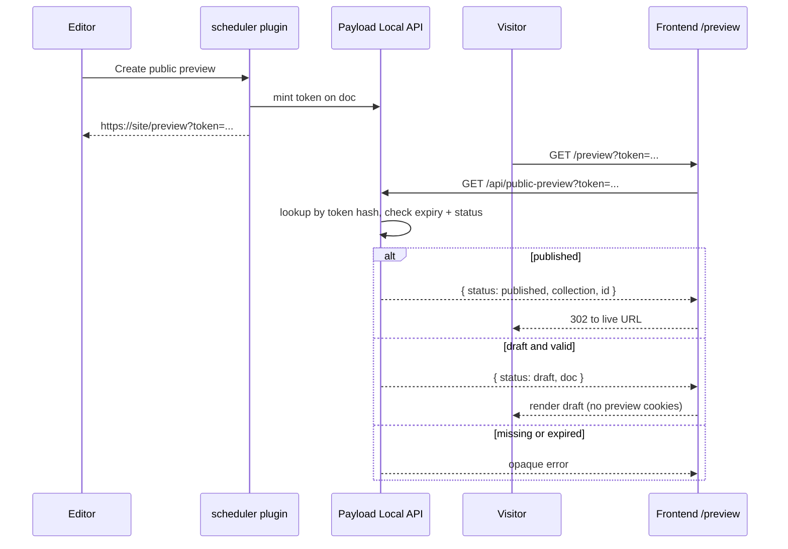

# Public preview (opt-in)

## Summary

Add an opt-in **capability-token** public preview feature to `payload-plugin-scheduler`: editors mint a shareable URL; possession of a valid, unexpired token authorizes reading **that draft only**. No user session, no staff JWT in the URL, no widening of GraphQL/`api`-role draft reads.

**v1 scope:** collections only. Globals are a follow-up (same field + endpoint model; no architectural blocker — see below).

This is a **new** plan. It does not replace the v3 migration `PLAN.md`.

## Auth model (locked)



### Rules

1. Do **not** change host-app draft access so API users can see drafts globally.
2. Do **not** put a staff JWT or Next preview-mode cookie in a public URL.
3. Token validation + draft fetch happen inside Payload; `overrideAccess: true` for **reading draft body** only after hash + expiry match.
4. Tokens are opaque (random bytes); store **SHA-256 hash** on the document. Raw token appears only in the mint response URL.
5. Expiry is enforced on resolve (`expiresAt`). Default TTL 14 days; at mint, `expiresAt = min(TTL, future publish_date)` when a future publish date exists.
6. On publish: clear hash + expiry (hard kill). Published docs never return draft via token — resolve returns `status: 'published'` identifiers for the frontend to redirect.
7. Revoke / remint: clear or replace the stored hash so old links die immediately.
8. Plugin config is host-agnostic (no hard-coded roles like `api`, no hard-coded frontend hosts).

### Why opaque hash (not Payload-secret JWT)

Publish-kill and editor revoke need server-side state. A bare signed JWT cannot revoke before `exp` without a version/`jti` field anyway. Opaque hash keeps preview crypto independent of Payload `secret` rotation.

## Decisions from design review

| Topic | Decision |
|-------|----------|
| Soft expiry | Check `expiresAt` on resolve. No cron required for security. |
| Housekeeping | **Lazy clear on expired resolve** (null hash when returning expired). Optional later: batch cleanup job. |
| Collection lookup | v1: scan enabled collections by hash (typically a handful). Document cost; revisit if needed. |
| Plugin surface | Opt-in `publicPreview` on `ScheduledPostConfig`. |
| Globals | **Next step** after collections. Same architecture (fields on entity + resolve). |
| Editorial auth | Authenticated user with collection update access. Configurable deny list optional; **no** hard-coded `api` role. |
| Field writes | Mint/revoke/invalidate use `overrideAccess: true` for hash fields (fields deny normal read/update). Mint still **pre-checks** editor can load/update the draft under normal access. |
| Error shape | Prefer **opaque** failure for invalid/expired (same status + body) to reduce probing signal. Frontend can treat all failures as “preview unavailable.” |
| Moving `publish_date` | Expiry is a **snapshot at mint**. Changing publish date does not auto-extend/shorten the link. Remint to refresh. (Optional later: hook to clamp expiry when publish date moves earlier.) |
| Resolve payload | Do **not** dump full `depth: 2` by default. Configurable depth (default `0` or `1`) and/or host `select` / `getPreviewDoc` callback. Host SSR prefers server-to-server fetch. |
| Plan file | This file (`PLAN-public-preview.md`). |

## Config surface

```ts
export type PublicPreviewConfig = {
  enabled: boolean
  /** Default 14 */
  ttlDays?: number
  /**
   * Absolute or host-relative path for the public URL.
   * Plugin appends `?token=...`.
   * Example: `https://example.com/preview`
   */
  frontendPreviewPath: string
  /** Default `public_preview_token_hash` */
  tokenHashField?: string
  /** Default `public_preview_expires_at` */
  expiresAtField?: string
  /** Depth for draft re-fetch on resolve. Default conservative (0 or 1). */
  resolveDepth?: number
  /**
   * Optional: reject mint/revoke for these user roles (host-specific).
   * Empty / omitted = any authenticated user who passes collection access.
   */
  denyRoles?: string[]
}

export interface ScheduledPostConfig {
  // ...existing
  publicPreview?: PublicPreviewConfig
}
```

Normalize defaults in `config.ts` when `publicPreview.enabled`.

## Numbered steps

1. **Config, fields, crypto, invalidate-on-publish**
   - Add `PublicPreviewConfig` + normalization (`ttlDays`, field names, `frontendPreviewPath` required when enabled).
   - Inject hidden indexed hash + date fields on enabled **collections** when `publicPreview.enabled`.
   - Field `access.read` / `access.update`: always deny (hash never leaves via REST/GraphQL).
   - Token helpers: `generateRawToken`, `hashToken`, `buildPreviewUrl`, `computeExpiresAt`, timing-safe compare.
   - `afterChange` hook: when `_status === 'published'`, clear hash + expiry with `overrideAccess` and a `context` skip flag to avoid recursion.
   - Wire only when public preview is enabled (alongside existing schedule hooks).
   - Unit tests: expiry math (`min(TTL, publish_date)`), URL builder, hash stability, publish clears fields.

2. **Mint / revoke / resolve endpoints**
   - Register root endpoints only when enabled:
     - `POST /public-preview/mint`
     - `POST /public-preview/revoke`
     - `GET /public-preview?token=`
   - **Mint:** require `req.user`; apply `denyRoles` if configured; validate collection is enabled; `findByID` with `req` (access enforced); reject if published; generate raw token; `update` hash/expiry with `overrideAccess: true` + `draft: true` after access pre-check; return `{ url, expiresAt }` once.
   - **Revoke:** same auth; clear hash/expiry with `overrideAccess`.
   - **Resolve:** unauthenticated; find by hash across enabled collections (`overrideAccess` for lookup only — fields are otherwise unreadable); check expiry; if expired → opaque error **and lazy-clear** hash; if published → `{ status: 'published', collection, id }` (no draft body); if draft → re-fetch with configured depth + `overrideAccess`, return `{ status: 'draft', collection, id, doc, expiresAt }`.
   - Integration tests in `dev/`: mint → resolve draft; expire → fail; publish → published status / cleared hash; revoke → fail; unauthenticated mint → 401.

3. **Admin UI affordance (minimal)**
   - Editor control near publish date (Generate / Copy / Revoke) calling mint/revoke.
   - Display expiry; never show raw token after leave (copy once from mint response).
   - Keep UI thin; endpoints are the source of truth.

4. **Docs + host integration notes**
   - README: opt-in `publicPreview`, security model, endpoint contract, recommended SSR resolve (server-to-server), opaque errors, expiry snapshot behavior.
   - Note globals as upcoming; collections-only in v1.
   - Document that live URL construction is the host app’s job from `{ collection, id }` (or optional future `getLivePath` config).

5. **Follow-up: globals** *(not blocking v1)*
   - Same fields on enabled globals; mint/revoke/resolve accept `type: 'global' | 'collection'`.
   - Resolve scan includes globals.
   - No fundamental misalignment with storing hash on the entity — only API/URL helper parameterization.

## Progress checklist

- [ ] `[1]` Config, fields, crypto, invalidate-on-publish; unit tests
- [ ] `[2]` Mint / revoke / resolve endpoints; integration tests
- [ ] `[3]` Minimal admin UI (mint/copy/revoke)
- [ ] `[4]` README + integration notes
- [ ] `[5]` Globals support (follow-up)

## Design notes (plain English reference)

### Writing the hash without contradicting field access

The hash fields are locked so normal API clients cannot read or edit them. Creating a preview therefore uses a privileged write (`overrideAccess`) **after** confirming the editor is allowed to touch that draft. Same pattern for revoke and clear-on-publish.

### Expiry without a sweeper

A link “dies” when resolve sees `expiresAt` in the past — even if the hash row is still in the database. Clearing the hash later is tidy, not what makes expiry work. Lazy-clear on expired resolve is the cheap middle ground.

### Finding the doc

The token does not encode which collection it belongs to. Resolve asks each enabled collection “anyone with this hash?” until one hits. Fine for a small allowlist; revisit if that list grows large.

### Draft versions

Payload keeps draft/published versions. Writing the hash must land on the draft the resolve query will find; clearing on publish must not leave a live hash on a version row that lookup still returns. Tests should cover draft mint → publish → old link dead.

### How much doc to return

Resolve can return a deep nested document. That is convenient for SSR and dangerous if a token leaks (draft + relations). Default shallow; let the host deepen or reshape.

### Error codes

Different codes for “never existed” vs “expired” help attackers map the token space. Opaque “unavailable” is slightly worse UX, better for probing resistance.

### Publish date vs link lifetime

Expiry is chosen when the link is created. Moving the schedule later does not extend an existing link; remint if needed.
